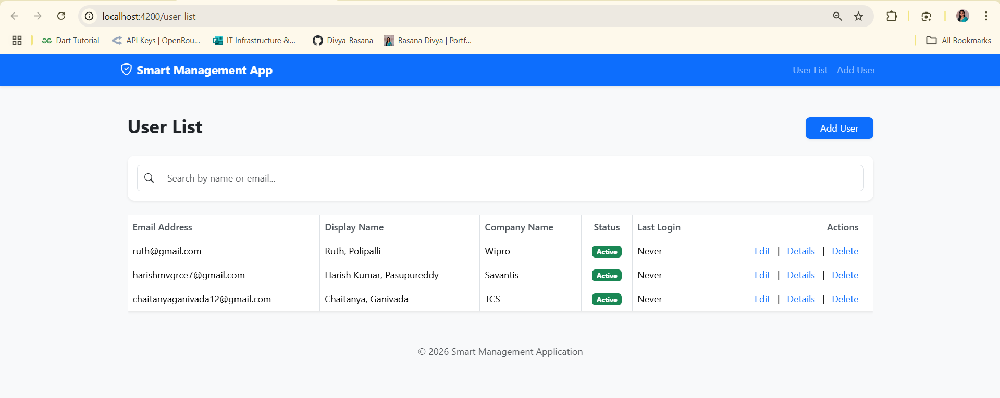
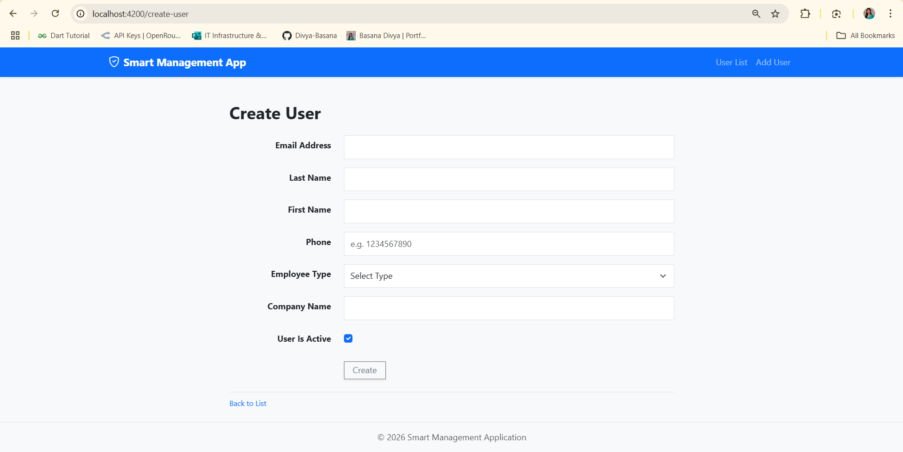
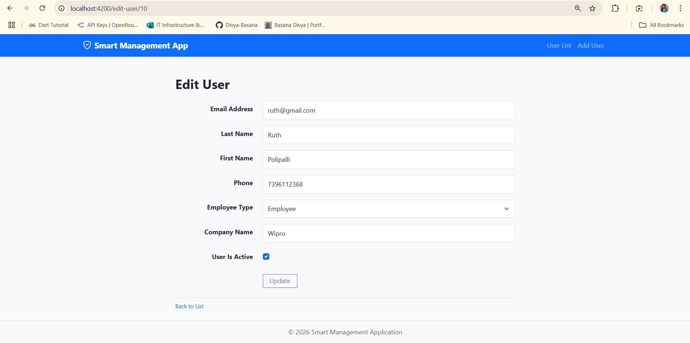
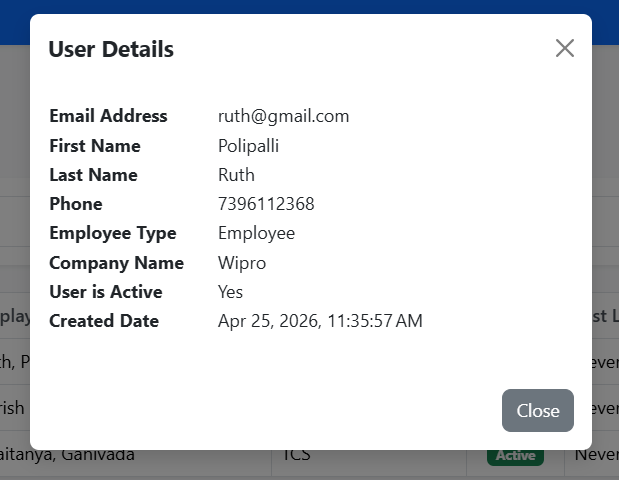
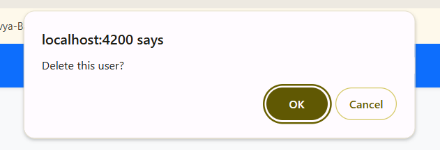

# Smart Management Application

A full-stack user management system designed for robust data handling and seamless user experience. This application provides a comprehensive CRUD (Create, Read, Update, Delete) interface to manage user records efficiently.

## Features

- **User Management:** Full CRUD operations for user accounts.
- **Modern UI:** Responsive and dynamic frontend interface.
- **RESTful API:** Robust backend architecture ensuring secure and fast data transmission.
- **Database Persistence:** Reliable data storage using SQL Server.
- **Cross-Origin Resource Sharing (CORS):** Configured for seamless communication between the frontend and backend.

## Tech Stack

**Frontend:**
- Angular
- TypeScript
- HTML5 / CSS3

**Backend:**
- ASP.NET Core Web API
- C#
- Entity Framework Core

**Database:**
- Microsoft SQL Server

## Prerequisites

Before you begin, ensure you have met the following requirements:
- **Node.js** and **npm** installed for the Angular frontend.
- **Angular CLI** installed globally (`npm install -g @angular/cli`).
- **.NET SDK** installed for the ASP.NET Core backend.
- **SQL Server** installed and running.

## Getting Started

Follow these steps to get the project up and running on your local machine.

### 1. Database Setup
Ensure your SQL Server instance is running. Update the connection string in the `appsettings.json` file located in the `SmartManagementApi` project to point to your database.

### 2. Backend Setup (ASP.NET Core API)
Navigate to the API directory, install dependencies, apply migrations, and run the server:
```bash
cd SmartManagementApi
dotnet restore
dotnet ef database update
dotnet run
```
The API will typically start on `http://localhost:5006`.

### 3. Frontend Setup (Angular App)
Navigate to the frontend directory, install dependencies, and start the development server:
```bash
cd SmartManagementApp
npm install
ng serve -o
```
The application will automatically open in your default browser at `http://localhost:4200`.

## Screenshots


1. **Dashboard / User List**
   > 

2. **Create User Form**
   > 

3. **Edit User Form**
   > 

4. **Details of User**
   > 

5. **Delete of User**
   > 
---
